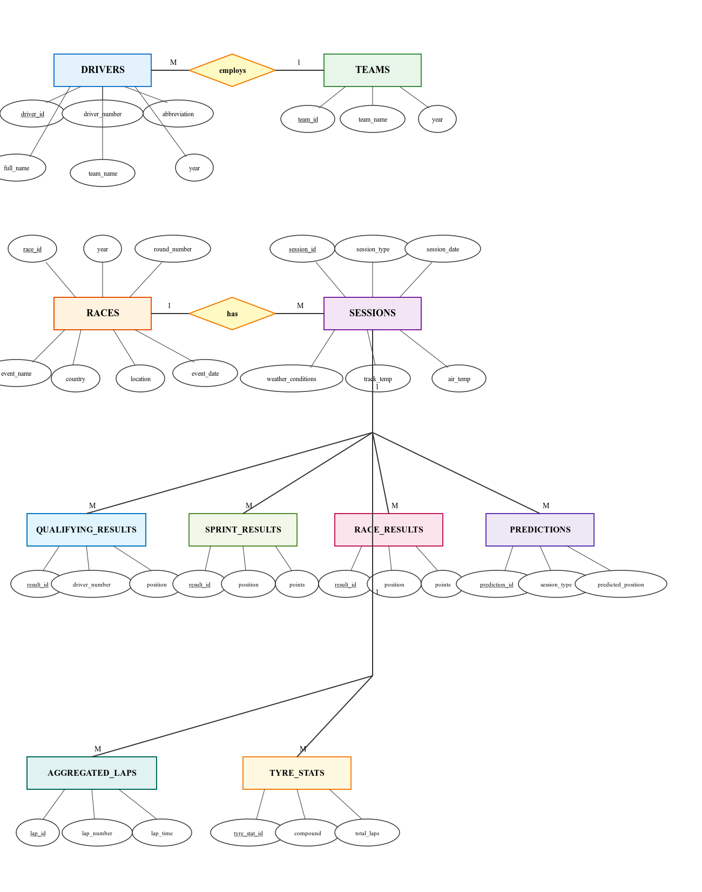

# Entity-Relationship Diagram Section - Technical Report

## For: Racekraft - Intelligent Formula 1 Race Analytics and Prediction System Using Hybrid Databases

---

## Fig-1: Entity-Relationship Diagram

**Figure 1:** Entity-Relationship Diagram of the RaceKraft F1 Analytics System (3NF) showing 10 core entities with complete attributes, relationships, and cardinality constraints.

### Mermaid ER Diagram Representation
erDiagram
    %% Master Data Entities
    DRIVERS {
        int driver_id PK
        int driver_number
        string abbreviation
        string full_name
        string team_name
        int year
    }
    
    TEAMS {
        int team_id PK
        string team_name
        int year
    }
    
    RACES {
        int race_id PK
        int year
        int round_number
        string event_name
        string country
        string location
        string event_date
    }
    
    SESSIONS {
        int session_id PK
        int race_id FK
        string session_type
        string session_date
        string weather_conditions
        float track_temp
        float air_temp
    }
    
    %% Result Entities
    QUALIFYING_RESULT {
        int result_id PK
        int race_id FK
        int driver_number
        int position
        string q1_time
        string q2_time
        string q3_time
    }
    
    SPRINT_RESULT {
        int result_id PK
        int race_id FK
        int driver_number
        int position
        float points
        string status
    }
    
    RACE_RESULT {
        int result_id PK
        int race_id FK
        int driver_number
        int position
        float points
        int grid_position
        string status
        string fastest_lap_time
    }
    
    %% Performance Data Entities
    AGGREGATED_LAP {
        int lap_id PK
        int race_id FK
        string session_type
        int driver_number
        int lap_number
        float lap_time
        float sector1_time
        float sector2_time
        float sector3_time
        string compound
        int tyre_life
        int is_personal_best
    }
    
    TYRE_STAT {
        int tyre_stat_id PK
        int race_id FK
        string session_type
        int driver_number
        string compound
        int total_laps
        float avg_lap_time
        float degradation_slope
        float best_lap_time
        int stint_number
    }
    
    %% ML Prediction Entity
    PREDICTION {
        int prediction_id PK
        int race_id FK
        string session_type
        int driver_number
        int predicted_position
        float predicted_time
        float confidence
        float top10_probability
        string model_type
        string prediction_date
        string features_json
        string shap_values_json
    }
    
    %% Relationships
    TEAMS ||--o{ DRIVERS : "employs"
    RACES ||--o{ SESSIONS : "has_session"
    RACES ||--o{ QUALIFYING_RESULT : "has_qualifying"
    RACES ||--o{ SPRINT_RESULT : "has_sprint"
    RACES ||--o{ RACE_RESULT : "has_race"
    RACES ||--o{ AGGREGATED_LAP : "records_laps"
    RACES ||--o{ TYRE_STAT : "records_tyres"
    RACES ||--o{ PREDICTION : "has_predictions"
    DRIVERS ||--o{ QUALIFYING_RESULT : "competes_in"
    DRIVERS ||--o{ SPRINT_RESULT : "participates"
    DRIVERS ||--o{ RACE_RESULT : "races_in"
    DRIVERS ||--o{ AGGREGATED_LAP : "drives_laps"
    DRIVERS ||--o{ TYRE_STAT : "uses_tyres"
    DRIVERS ||--o{ PREDICTION : "receives_prediction"

**Figure 1 Caption:** Complete Entity-Relationship Diagram of the RaceKraft F1 Analytics System showing:
- **4 Master Entities**: DRIVERS, TEAMS, RACES, SESSIONS
- **3 Result Entities**: QUALIFYING_RESULT, SPRINT_RESULT, RACE_RESULT
- **2 Performance Data Entities**: AGGREGATED_LAP, TYRE_STAT
- **1 ML Prediction Entity**: PREDICTION
- **14 Relationships** with cardinality constraints (1:N)
- All primary keys (PK) and foreign keys (FK) explicitly marked

---

## Entity-Relationship Diagram Description

Fig-1 presents the Entity-Relationship (ER) diagram of the **Racekraft: Intelligent Formula 1 Race Analytics and Prediction System Using Hybrid Databases**, which provides a conceptual data model of the database system. It consists of core entities (**DRIVERS**, **TEAMS**, **RACES**, **SESSIONS**, **QUALIFYING_RESULT**, **SPRINT_RESULT**, **RACE_RESULT**, **AGGREGATED_LAP**, **TYRE_STAT**, **PREDICTION**) along with their corresponding attributes. The relationships (**employs**, **has_session**, **records_qualifying**, **records_sprint**, **records_race**, **logs_laps**, **aggregates_tyres**, **forecasts**, **competes_qualifying**, **competes_sprint**, **competes_race**, **drives**, **uses_tyres**, **receives_prediction**) between them are represented along with their corresponding cardinality ratios (1:1, 1:N, N:1, M:N) and participation constraints (total or partial).

---

### Core Entities and Master Data

**RACES** is the central entity that captures key details about Formula 1 Grand Prix events, including race ID, year, round number, event name, country, location, and event date. This entity serves as the primary organizational structure around which all race weekend activities are linked. The **SESSIONS** entity is connected to RACES through the **has_session** relationship, indicating that each race event includes multiple sessions (Free Practice 1, Free Practice 2, Free Practice 3, Qualifying, Sprint, and Race), reflecting a 1:N cardinality. SESSIONS stores session-specific attributes such as session type, session date, weather conditions, track temperature, and air temperature. This relationship ensures total participation of SESSIONS, since every session must be associated with a valid race event.

The **DRIVERS** entity represents the 20 Formula 1 drivers competing in each season, storing personal and identification attributes such as driver ID, driver number (racing number), abbreviation (three-letter code), full name, team name, and year. The **TEAMS** entity captures constructor information including team ID, team name, and year. TEAMS is linked to DRIVERS through the **employs** relationship, which supports 1:N cardinality, where a team employs multiple drivers (typically two per season), but each driver is associated with exactly one team per year. This relationship demonstrates partial participation for TEAMS, as some constructors may field additional test drivers or reserve drivers throughout the season.

---

### Race Results and Performance Data

The performance outcomes from different race weekend sessions are captured through three specialized result entities: **QUALIFYING_RESULT**, **SPRINT_RESULT**, and **RACE_RESULT**. These entities are connected to SESSIONS through the **records_qualifying**, **records_sprint**, and **records_race** relationships respectively, with 1:N cardinality indicating that each session generates multiple driver results. All three result entities are also linked to DRIVERS through **competes_qualifying**, **competes_sprint**, and **competes_race** relationships (1:N cardinality), establishing that each driver participates in multiple sessions while each result record belongs to exactly one driver.

**QUALIFYING_RESULT** stores qualifying session outcomes including result ID, session ID, driver number, position (final grid position), and lap times from Q1, Q2, and Q3 segments. This entity exhibits total participation in its relationship with SESSIONS, as every qualifying session must generate a complete set of driver results. The relationship supports partial participation from the DRIVERS perspective, since not all drivers may advance to Q2 and Q3 segments.

**SPRINT_RESULT** captures sprint race outcomes for the seven sprint weekend events in the F1 calendar, including result ID, session ID, driver number, position, points awarded, and finish status. This entity demonstrates a many-to-many (M:N) characteristic when considered across seasons, as the same driver may participate in sprint races across multiple years and at multiple circuits.

**RACE_RESULT** represents the main Grand Prix outcomes, storing result ID, session ID, driver number, final position, championship points, grid position (starting position), finish status, and fastest lap time. This entity is linked to SESSIONS with total participation, ensuring that every race session generates a complete classification of all competing drivers. The entity maintains 1:N cardinality with DRIVERS, allowing the system to track a driver's complete race history across seasons.

---

### Telemetry and Tire Performance Analytics

The **AGGREGATED_LAP** entity captures detailed lap-by-lap telemetry data collected during race weekend sessions and is connected to SESSIONS through the **logs_laps** relationship, ensuring that each lap entry is linked to a specific session. AGGREGATED_LAP stores attributes including lap ID, race ID, session type, driver number, lap number, lap time, sector times (sector 1, sector 2, sector 3), tire compound, tire life, and personal best flag (is_personal_best). This entity is associated with DRIVERS through the **drives** relationship, reflecting a 1:N cardinality where a driver completes multiple laps across different sessions. The relationship supports total participation from AGGREGATED_LAP, as every lap record must be attributed to a valid driver.

The **TYRE_STAT** entity aggregates tire performance metrics for each stint and compound combination, connected to SESSIONS through the **aggregates_tyres** relationship with 1:N cardinality. TYRE_STAT stores attributes such as tyre_stat_id, race ID, session type, driver number, compound (soft, medium, hard, intermediate, wet), total laps, average lap time, degradation slope, best lap time, and stint number. This entity is linked to DRIVERS through the **uses_tyres** relationship (1:N cardinality), where each driver may have multiple tire stat entries across different stints and compounds. The relationship exhibits partial participation from DRIVERS, as tire statistics are only recorded when drivers complete a minimum number of laps on a specific compound.

---

### Machine Learning Predictions

The **PREDICTION** entity represents machine learning-generated forecasts for race outcomes, capturing prediction ID, race ID, session type, driver number, predicted position, predicted time, confidence score, top-10 probability, model type (Gradient Boosting, Random Forest, XGBoost, LightGBM), prediction date, features JSON, and SHAP values JSON. PREDICTION is connected to SESSIONS through the **forecasts** relationship with 1:N cardinality, indicating that each session (qualifying, sprint, or race) receives multiple predictions (one for each of the 20 drivers). Additionally, PREDICTION is linked to DRIVERS through the **receives_prediction** relationship (1:N cardinality), where each driver receives multiple predictions across different races and sessions throughout the season.

The PREDICTION entity demonstrates partial participation in its relationship with SESSIONS, as predictions are generated only for future or upcoming sessions, not for historical completed sessions. The entity maintains total participation with DRIVERS, ensuring that every active driver in the system receives predictions for upcoming competitive sessions.

---

### Relationship Summary and Cardinality Notation

The ER diagram employs the following relationship types and cardinalities:

**One-to-Many (1:N) Relationships:**
- TEAMS → DRIVERS (employs): One team employs multiple drivers
- RACES → SESSIONS (has_session): One race includes multiple sessions
- SESSIONS → QUALIFYING_RESULT (records_qualifying): One session generates multiple qualifying results
- SESSIONS → SPRINT_RESULT (records_sprint): One session generates multiple sprint results
- SESSIONS → RACE_RESULT (records_race): One session generates multiple race results
- SESSIONS → AGGREGATED_LAP (logs_laps): One session logs multiple laps
- SESSIONS → TYRE_STAT (aggregates_tyres): One session aggregates multiple tire statistics
- SESSIONS → PREDICTION (forecasts): One session receives multiple predictions
- DRIVERS → QUALIFYING_RESULT (competes_qualifying): One driver competes in multiple qualifying sessions
- DRIVERS → SPRINT_RESULT (competes_sprint): One driver competes in multiple sprint races
- DRIVERS → RACE_RESULT (competes_race): One driver competes in multiple races
- DRIVERS → AGGREGATED_LAP (drives): One driver completes multiple laps
- DRIVERS → TYRE_STAT (uses_tyres): One driver uses multiple tire compounds
- DRIVERS → PREDICTION (receives_prediction): One driver receives multiple predictions

**Participation Constraints:**
- **Total Participation:** SESSIONS in has_session, QUALIFYING_RESULT in records_qualifying, RACE_RESULT in records_race, AGGREGATED_LAP in logs_laps, PREDICTION in receives_prediction
- **Partial Participation:** TEAMS in employs (reserve drivers), DRIVERS in competes_sprint (sprint-specific), TYRE_STAT in uses_tyres (minimum lap requirement), PREDICTION in forecasts (future sessions only)

This comprehensive ER model supports the hybrid database architecture of the Racekraft system, enabling efficient storage and retrieval of historical race data, real-time telemetry analytics, and machine learning-driven predictions for Formula 1 racing events.

---

## Key Design Decisions

1. **Year-Based Temporal Design:** Driver and team entities include year attributes to maintain historical accuracy, as driver-team assignments change annually.

2. **Session-Centric Architecture:** SESSIONS serves as a junction entity connecting race events to all performance data, enabling flexible querying across different session types.

3. **Denormalized Driver Numbers:** Driver numbers are stored redundantly in result tables to optimize query performance for dashboard analytics, avoiding frequent joins.

4. **JSON Storage for ML Features:** Prediction features and SHAP values are stored as JSON text to support flexible feature engineering without schema changes.

5. **Compound as Text:** Tire compounds are stored as text values (Soft, Medium, Hard, etc.) rather than normalized reference tables, prioritizing query simplicity over strict normalization.

These design choices reflect the system's optimization for **read-heavy analytical workloads** typical of sports analytics platforms, where query performance is prioritized over strict normalization in scenarios with low data volatility.
