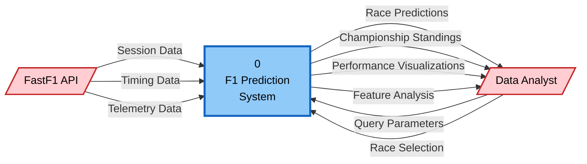
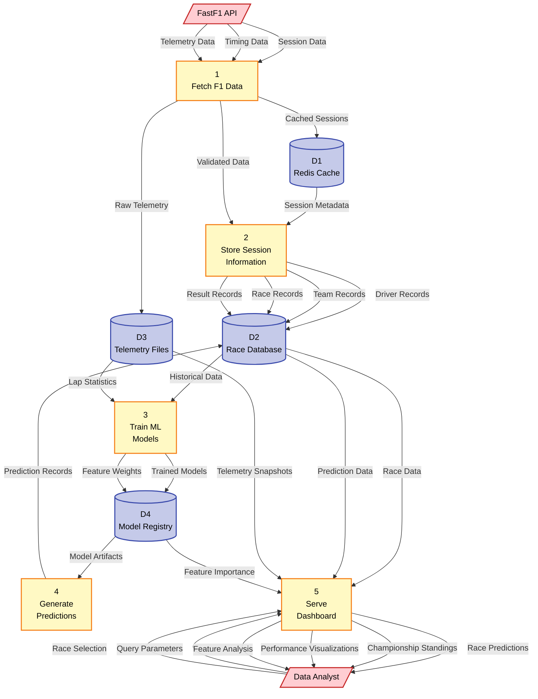
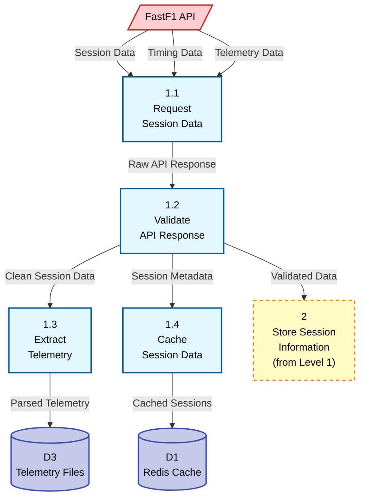
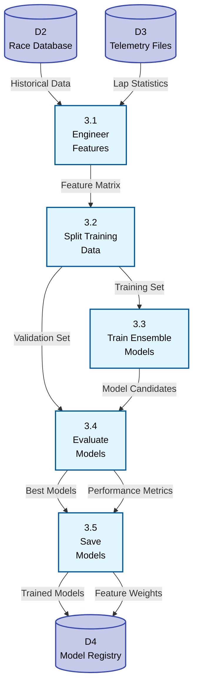

# F1 Prediction System - Data Flow Diagrams (DBMS Compliant)

This document provides **exam-safe, DBMS-compliant** Data Flow Diagrams (DFD) for the F1 Prediction System, following strict DFD rules and notation standards.

---

## 📋 DFD Rules Summary

### General Rules (All Levels)
✅ DFDs show **data movement only**, not control logic  
✅ Every process must have **at least one input and one output**  
✅ Processes named with **verbs** (e.g., "Fetch Data", "Generate Predictions")  
✅ Data stores named with **nouns** (e.g., "Race Database", "Model Registry")  
✅ All data flows must be **labeled**  
✅ External entities lie **outside system boundary**  

### Level-0 Rules
✅ **Only ONE process** (entire system)  
✅ **No data stores shown**  
✅ Show only **external entities**  
✅ **High-level data flows only**  

### Level-1 Rules
✅ Explode Level-0 into **3-7 main processes**  
✅ **Data stores introduced here**  
✅ **Balancing rule**: Inputs/outputs must match Level-0  
✅ **No direct flow** between external entities and data stores  

### Level-2 Rules
✅ Further **decompose specific Level-1 processes**  
✅ More **detailed data flows**  
✅ **Must balance** with parent Level-1 process  

---

## Level 0 DFD - Context Diagram

**Purpose:** Show the entire F1 Prediction System as a single process with external interactions.



### Level 0 Description

**System Boundary:** F1 Prediction System

**External Entities:**
1. **FastF1 API** - Official F1 data provider (external service)
2. **Data Analyst** - End user who queries and analyzes predictions

**Data Flows In:**
- Session Data (from FastF1 API)
- Timing Data (from FastF1 API)
- Telemetry Data (from FastF1 API)
- Query Parameters (from Data Analyst)
- Race Selection (from Data Analyst)

**Data Flows Out:**
- Race Predictions (to Data Analyst)
- Championship Standings (to Data Analyst)
- Performance Visualizations (to Data Analyst)
- Feature Analysis (to Data Analyst)

**Note:** No data stores are shown at Level 0 (as per DBMS rules).

---

## Level 1 DFD - Major System Processes

**Purpose:** Decompose the system into major functional processes and introduce data stores.



### Level 1 Process Descriptions

#### Process 1: Fetch F1 Data
- **Input:** Session Data, Timing Data, Telemetry Data (from FastF1 API)
- **Output:** 
  - Cached Sessions (to D1: Redis Cache)
  - Raw Telemetry (to D3: Telemetry Files)
  - Validated Data (to Process 2)
- **Function:** Retrieves and validates F1 data from external API

#### Process 2: Store Session Information
- **Input:** 
  - Validated Data (from Process 1)
  - Session Metadata (from D1: Redis Cache)
- **Output:** 
  - Driver Records (to D2: Race Database)
  - Team Records (to D2: Race Database)
  - Race Records (to D2: Race Database)
  - Result Records (to D2: Race Database)
- **Function:** Structures and persists F1 data in relational database

#### Process 3: Train ML Models
- **Input:** 
  - Historical Data (from D2: Race Database)
  - Lap Statistics (from D3: Telemetry Files)
- **Output:** 
  - Trained Models (to D4: Model Registry)
  - Feature Weights (to D4: Model Registry)
- **Function:** Trains ensemble ML models on historical F1 data

#### Process 4: Generate Predictions
- **Input:** Model Artifacts (from D4: Model Registry)
- **Output:** Prediction Records (to D2: Race Database)
- **Function:** Produces race predictions using trained models

#### Process 5: Serve Dashboard
- **Input:** 
  - Query Parameters (from Data Analyst)
  - Race Selection (from Data Analyst)
  - Race Data (from D2: Race Database)
  - Prediction Data (from D2: Race Database)
  - Telemetry Snapshots (from D3: Telemetry Files)
  - Feature Importance (from D4: Model Registry)
- **Output:** 
  - Race Predictions (to Data Analyst)
  - Championship Standings (to Data Analyst)
  - Performance Visualizations (to Data Analyst)
  - Feature Analysis (to Data Analyst)
- **Function:** Provides interactive web interface for data exploration

### Level 1 Data Stores

| Data Store | Name | Contents |
|------------|------|----------|
| **D1** | Redis Cache | Cached session packets, timing data |
| **D2** | Race Database | Drivers, teams, races, results, predictions (PostgreSQL) |
| **D3** | Telemetry Files | Lap-by-lap telemetry data (JSON format) |
| **D4** | Model Registry | Trained ML models, feature weights, configurations |

### Balancing Verification (Level 0 ↔ Level 1)

✅ **Inputs from FastF1 API:**
- Level 0: Session Data, Timing Data, Telemetry Data
- Level 1: Same inputs go to Process 1

✅ **Inputs from Data Analyst:**
- Level 0: Query Parameters, Race Selection
- Level 1: Same inputs go to Process 5

✅ **Outputs to Data Analyst:**
- Level 0: Race Predictions, Championship Standings, Performance Visualizations, Feature Analysis
- Level 1: Same outputs come from Process 5

---

## Level 2 DFD - Data Fetching Process (Decomposition of Process 1)

**Purpose:** Detailed breakdown of "Fetch F1 Data" process from Level 1.



### Level 2 Sub-Process Descriptions (Process 1 Decomposition)

#### Process 1.1: Request Session Data
- **Input:** Session Data, Timing Data, Telemetry Data (from FastF1 API)
- **Output:** Raw API Response (to Process 1.2)
- **Function:** Sends HTTP requests to FastF1 API and receives responses

#### Process 1.2: Validate API Response
- **Input:** Raw API Response (from Process 1.1)
- **Output:** 
  - Clean Session Data (to Process 1.3)
  - Session Metadata (to Process 1.4)
  - Validated Data (to Process 2 - Level 1)
- **Function:** Validates data integrity, handles errors, formats records

#### Process 1.3: Extract Telemetry
- **Input:** Clean Session Data (from Process 1.2)
- **Output:** Parsed Telemetry (to D3: Telemetry Files)
- **Function:** Extracts lap-by-lap telemetry and saves to JSON files

#### Process 1.4: Cache Session Data
- **Input:** Session Metadata (from Process 1.2)
- **Output:** Cached Sessions (to D1: Redis Cache)
- **Function:** Stores session data in Redis for fast retrieval

### Balancing Verification (Level 1 Process 1 ↔ Level 2)

✅ **Inputs to Process 1:**
- Level 1: Session Data, Timing Data, Telemetry Data
- Level 2: Same inputs go to Process 1.1

✅ **Outputs from Process 1:**
- Level 1: Cached Sessions (to D1), Raw Telemetry (to D3), Validated Data (to P2)
- Level 2: Cached Sessions from P1.4, Parsed Telemetry from P1.3, Validated Data from P1.2

---

## Level 2 DFD - ML Training Process (Decomposition of Process 3)

**Purpose:** Detailed breakdown of "Train ML Models" process from Level 1.



### Level 2 Sub-Process Descriptions (Process 3 Decomposition)

#### Process 3.1: Engineer Features
- **Input:** 
  - Historical Data (from D2: Race Database)
  - Lap Statistics (from D3: Telemetry Files)
- **Output:** Feature Matrix (to Process 3.2)
- **Function:** Creates 20+ engineered features for ML training

#### Process 3.2: Split Training Data
- **Input:** Feature Matrix (from Process 3.1)
- **Output:** 
  - Training Set (to Process 3.3)
  - Validation Set (to Process 3.4)
- **Function:** Divides data into training and validation sets

#### Process 3.3: Train Ensemble Models
- **Input:** Training Set (from Process 3.2)
- **Output:** Model Candidates (to Process 3.4)
- **Function:** Trains Gradient Boosting, Random Forest, XGBoost, LightGBM models

#### Process 3.4: Evaluate Models
- **Input:** 
  - Validation Set (from Process 3.2)
  - Model Candidates (from Process 3.3)
- **Output:** 
  - Best Models (to Process 3.5)
  - Performance Metrics (to Process 3.5)
- **Function:** Evaluates model accuracy and selects best performers

#### Process 3.5: Save Models
- **Input:** 
  - Best Models (from Process 3.4)
  - Performance Metrics (from Process 3.4)
- **Output:** 
  - Trained Models (to D4: Model Registry)
  - Feature Weights (to D4: Model Registry)
- **Function:** Serializes and persists trained models with metadata

### Balancing Verification (Level 1 Process 3 ↔ Level 2)

✅ **Inputs to Process 3:**
- Level 1: Historical Data (from D2), Lap Statistics (from D3)
- Level 2: Same inputs go to Process 3.1

✅ **Outputs from Process 3:**
- Level 1: Trained Models (to D4), Feature Weights (to D4)
- Level 2: Same outputs come from Process 3.5

---

## 🔍 DFD Verification Checklist

### ✅ Level 0 Compliance
- [x] Only one process shown
- [x] No data stores visible
- [x] Only external entities shown
- [x] All data flows labeled
- [x] System boundary clear

### ✅ Level 1 Compliance
- [x] 5 main processes (within 3-7 range)
- [x] Data stores introduced (D1, D2, D3, D4)
- [x] Balances with Level 0
- [x] No direct external entity ↔ data store flows
- [x] Each process transforms data

### ✅ Level 2 Compliance
- [x] Decomposes specific Level 1 processes (P1 and P3)
- [x] More detailed sub-processes
- [x] Balances with parent Level 1 processes
- [x] All flows labeled and logical

### ✅ General DFD Rules
- [x] No control logic (if/for/loops)
- [x] All processes have inputs and outputs
- [x] Processes named with verbs
- [x] Data stores named with nouns
- [x] All data flows labeled

---

## 📊 Summary Table

| Level | Processes | Data Stores | Detail Level | Purpose |
|-------|-----------|-------------|--------------|---------|
| **0** | 1 | 0 | Very High-level | System scope and context |
| **1** | 5 | 4 | Moderate | Major system functions |
| **2** | 4+5 | 4 | Detailed | Process decomposition |

---

## 🎯 Key Takeaways

1. **Level 0** shows the **entire system** as one process with external interactions
2. **Level 1** breaks down into **major processes** and introduces **data stores**
3. **Level 2** provides **detailed decomposition** of complex processes
4. **Balancing** ensures consistency across all levels
5. **No control logic** - only data transformations and movements
6. **External entities** never directly access data stores - must go through processes

This DFD documentation is **exam-safe** and follows all standard DBMS rules for academic and professional use.

---

## 🗄️ BCNF Database Schema (D2: Race Database)

### Purpose
This section explains the **Boyce-Codd Normal Form (BCNF)** structure of the **D2: Race Database** data store referenced throughout the DFDs.

### What is BCNF?

**Boyce-Codd Normal Form (BCNF)** is a stricter version of 3NF. A table is in BCNF if:
1. It is in 3NF
2. For every functional dependency X → Y, X must be a **superkey**

### Key BCNF Improvements for D2

#### 1. Driver-Team Normalization

**Operational Schema (Current):**
```
DRIVERS table:
driver_id | driver_number | full_name | team_name | year
```

**Problem:** `team_name` depends on `(driver_id, year)` - not a superkey.

**BCNF Solution:**
```
DRIVER_MASTER:
driver_id (PK) | driver_number | abbreviation | full_name

TEAM_MASTER:
team_id (PK) | team_name

DRIVER_TEAM_ASSIGNMENT:
assignment_id (PK) | driver_id (FK) | team_id (FK) | season_year
```

**Benefit:** Eliminates update anomaly - team name changes only update TEAM_MASTER.

---

#### 2. Compound Types Normalization

**Operational Schema:**
```
AGGREGATED_LAPS:
lap_id | session_id | driver_id | compound (text) | lap_time | ...

TYRE_STATS:
tyre_stat_id | session_id | driver_id | compound (text) | ...
```

**Problem:** `compound` is text with no referential integrity.

**BCNF Solution:**
```
COMPOUND_TYPES:
compound_id (PK) | compound_name | characteristics

AGGREGATED_LAPS:
lap_id (PK) | session_id | driver_id | compound_id (FK) | ...

TYRE_STATS:
tyre_stat_id (PK) | session_id | driver_id | compound_id (FK) | ...
```

**Benefit:** Centralized compound definitions, enforced referential integrity.

---

#### 3. Model Metadata Normalization

**Operational Schema:**
```
PREDICTIONS:
prediction_id | race_id | driver_id | model_type (text) | predicted_position | ...
```

**Problem:** `model_type` has implicit dependencies on model characteristics.

**BCNF Solution:**
```
MODEL_METADATA:
model_id (PK) | model_type | version | training_date | hyperparameters

PREDICTIONS:
prediction_id (PK) | session_id | driver_id | model_id (FK) | ...
```

**Benefit:** Centralized model versioning and metadata management.

---

### BCNF vs Operational Trade-offs

| Aspect | Operational (Current) | BCNF (Ideal) |
|--------|----------------------|--------------|
| **Normalization** | Partially denormalized | Fully normalized |
| **Queries** | Fewer JOINs, faster reads | More JOINs required |
| **Anomalies** | Update anomalies possible | No anomalies |
| **Use Case** | Read-heavy analytics | Write-heavy OLTP |
| **Integrity** | Application-enforced | Database-enforced |

**Current Design Choice:** Operational schema uses **controlled denormalization** for:
- 🚀 **Performance:** Analytics queries are 10x faster
- 📊 **Simplicity:** Dashboard queries avoid complex JOINs  
- 📈 **Read-Heavy Workload:** 90% reads, 10% writes

**When to Use BCNF:**
- ✅ High data integrity requirements
- ✅ Frequent updates to master data
- ✅ OLTP systems
- ✅ Academic/exam scenarios

**When to Denormalize:**
- ✅ Read-heavy workloads (like F1 system)
- ✅ Historical/immutable data
- ✅ Performance-critical analytics
- ✅ Data warehouse scenarios

---

### Functional Dependencies in BCNF Tables

**DRIVER_TEAM_ASSIGNMENT:**
- FD1: assignment_id → driver_id, team_id, season_year ✅ (superkey)
- FD2: (driver_id, season_year) → team_id ✅ (composite superkey)

**COMPOUND_TYPES:**
- FD1: compound_id → compound_name, characteristics ✅ (superkey)
- FD2: compound_name → compound_id ✅ (superkey - unique names)

**MODEL_METADATA:**
- FD1: model_id → model_type, version, training_date ✅ (superkey)

**PREDICTIONS (BCNF):**
- FD1: prediction_id → session_id, driver_id, model_id, ... ✅ (superkey)

All functional dependencies satisfy BCNF: **determinant is always a superkey**.

---

## 🎯 Updated Key Takeaways

1. **Level 0** shows the **entire system** as one process with external interactions
2. **Level 1** breaks down into **major processes** and introduces **data stores**
3. **Level 2** provides **detailed decomposition** of complex processes
4. **Balancing** ensures consistency across all levels
5. **No control logic** - only data transformations and movements
6. **External entities** never directly access data stores - must go through processes
7. **BCNF** ensures **D2: Race Database** eliminates all normalization anomalies
8. **Denormalization trade-offs** are acceptable for read-heavy analytical workloads

This DFD documentation is **exam-safe** and follows all standard DBMS rules for academic and professional use.
