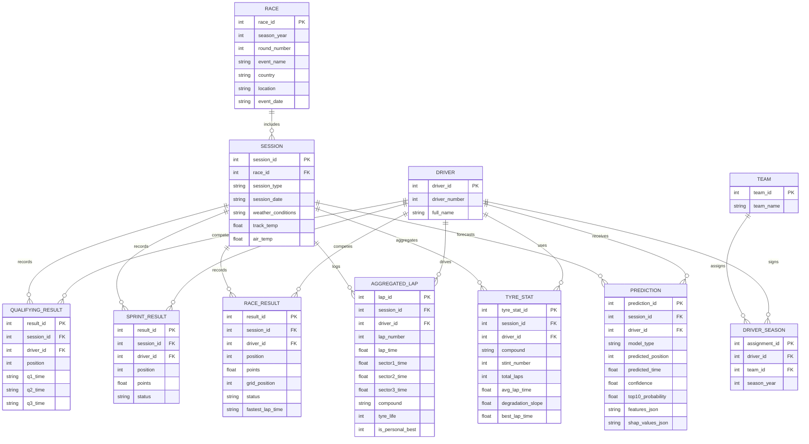
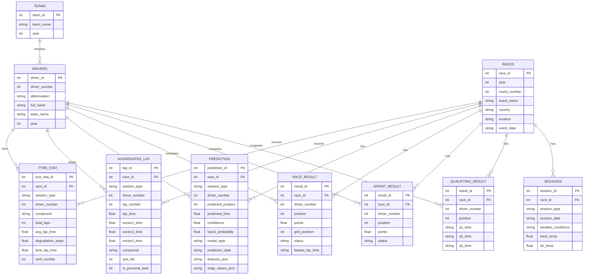

# Data Flow and Normalization Overview

## Data Flow Diagrams

### Level 1 — Platform Context

The level 1 diagram frames the entire platform: FastF1 exposes time-series data, [src/data_fetcher.py](src/data_fetcher.py) centralizes ingestion, three storage mediums persist different shapes of data, and both the ML pipeline and Streamlit dashboard read from the stores while feeding insights back to analysts.

### Level 2 — Data Fetcher Decomposition

Level 2 breaks the ingestion process into request, normalization, and persistence steps while emphasizing that Redis accelerates replays and both downstream consumers reuse the curated outputs.

### Level 3 — ML Pipeline Decomposition

The level 3 view zooms in on the ML notebook and automation path: relational data and telemetry power feature creation, models are trained and scored, validated artifacts are versioned, and predictions plus explainability outputs feed both the analytical notebook and the live dashboard.

## Normalization Journey

The FastF1 feed arrives as nested telemetry structures. The project normalizes those records through successive stages before loading the production schema.

### Actual Raw Capture (0NF Baseline)

The initial capture mirrors the FastF1 bundle: multi-valued arrays mix driver, team, laps, and predictions inside a single record, violating First Normal Form because repeating groups and nested structures coexist in one row.

### First Normal Form (1NF)

The 1NF stage flattens repeating groups so every session-driver combination is a separate row. However, attributes such as driver_name and team_name still depend only on part of the composite key (event_id, session_type, driver_number), leaving partial dependency issues for 2NF.

### Second Normal Form (2NF)

By isolating DRIVER and TEAM, every non-key attribute in SESSION_RESULT depends on the full primary key, eliminating partial dependencies. Team details are now referenced through surrogate keys, yet TEAM still carries year-specific context inside its rows, creating a transitive dependency.

### Third Normal Form (3NF)

The 3NF model removes transitive dependencies by splitting driver-team assignments into DRIVER_SEASON, isolating sessions, and distributing telemetry, tyre, and prediction facts into purpose-built entities. Every non-key attribute depends solely on its primary key.

### Actual Operational Schema (Production Alignment)

The deployed database mirrors the entity set described in [docs/dgm.md](docs/dgm.md). Driver rows intentionally retain the team_name for the given season to streamline analytical queries, while race-centric tables separate qualifying, sprint, race, telemetry, tyre, and prediction facts without duplicating session metadata.
